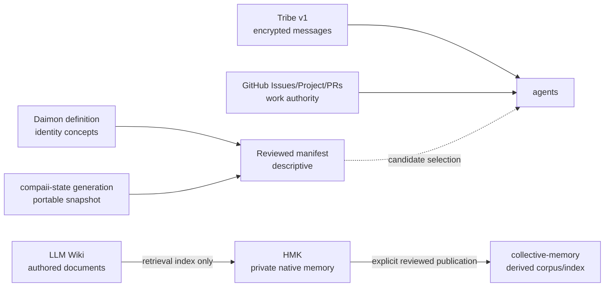

# Adversarial review and integration roadmap

Status: 2026-07-31. This document distinguishes implemented draft controls from
deployed guarantees. No draft PR listed here is production merely because its
tests pass.

## Executive finding

The original system mixed six different planes—messages, work ownership,
private memory, curated knowledge, public/collective publication, and portable
identity—through filenames, conventions, and shared operator assumptions.
That made the happy path productive but made recovery, compromise, concurrency,
and agent disagreement unsafe.

The remediation assigns one authority to each plane and adds closed,
evidence-bound crossings:

The Daimon selector does not authorize actions. collective-memory does not
become a private-memory authority. Tribe does not own task claims. GitHub does
not hold encryption keys.

## Findings and concrete remediation

| Severity | Adversarial finding | Remediation / status |
|---|---|---|
| Critical | Tribe v0 used experimental identity/crypto/delivery assumptions and encouraged accidental continued use. | v0 is contained in draft PR #13. No compatibility parser or dual write exists in v1. |
| Critical | Preserving v0 inbox history would add downgrade/migration code around data with no durable value. | Explicit decision: v0 history is disposable. Cutover purges it; rollback never re-enables v0. |
| Critical | `compaii-state` sync could publish surprising whole-state or secret-bearing changes; restore could overwrite healthy runtime code/state. | Stage-only/scan/plan/conflict/backup/rollback contract in compaii-state PR #1. |
| Critical | `compaii-state` carried two independently versioned `hmk-memory` copies (active plus timestamped backup), capable of regressing the deployed canonical plugin. | Both copies removed in PR #3; external source is commit/tree pinned and drift fails closed. |
| High | HMK, generated “wiki”, and the authored LLM Wiki were described as one universal canon. | Ownership policy in hermes-memory-kit PR #2; projection overlap is rejected in code. |
| High | Directly “syncing” private HMK into collective-memory could leak identity, episodes, credentials, or Wiki replicas and create competing truth. | One-way dual-opt-in publication adapter in PR #4; private/non-native/secret content fails closed; receipts and revocation exist. |
| High | GitHub comments and local inbox messages could both look like task ownership, causing concurrent edits. | Append-only leased claims and PR gates in Tribe PR #17; GitHub is authority, Tribe is notification. |
| High | Multiple agents share a GitHub account, so GitHub attribution is not agent attribution; comments can be edited/deleted. | Explicitly documented limitation. Next control is separate GitHub App principals, detached signatures, and external hash anchoring. |
| High | Daimon Matrix prose could be interpreted as executable policy (“all”, “pull”, capability advertising) without consent or trust definitions. | Closed inventory/manifests/selectors in issue #12; metaphor cannot map to policy and selection returns `authorization: not-evaluated`. |
| High | A central broker can observe timing, sender/recipient IDs, sizes, and availability even when payloads are encrypted. | v1 encrypts payloads/endpoints and authenticates operations, but metadata minimization, padding, federation, and traffic analysis remain future work. |
| High | Passing tests on stacked draft branches can obscure deploy ordering and rollback dependencies. | Every PR is draft and stacked explicitly; deployment requires reviewed commits, drill receipts, and a cutover gate. |
| Medium | collective-memory frontmatter is currently indexed as text rather than structured provenance. | Interface proposal sent to Mariano in collective-memory issue #1; no unilateral index/runtime change. |
| Medium | The stale `mccompaii` profile DB is a second old database, although all 45 titles exist in the canonical DB (43 identical, 2 newer canon). | No deletion without owner intent. CompAII has been asked whether the profile is legacy/retirable. |
| Medium | Old Wiki pages may state historical Tribe/APL/daemon mappings as current. | Publish a reviewed current project/evidence note and mark old pages historical through `wiki_publish`/`wiki_maintain`; raw evidence must not be rewritten. |
| Medium | The reviewed Daimon manifest can describe evidence but cannot independently attest capability quality or live health. | Future evaluator-signed probes and short-lived runtime attestations; do not overload the portability manifest. |

## Implemented draft stack

### Tribe and coordination

| PR | Role | Base |
|---|---|---|
| tribe-bridge #13 | v0 containment | `main` |
| tribe-bridge #14 | v1 protocol/threat model/vectors | `main` |
| tribe-bridge #15 | durable broker | #14 branch |
| tribe-bridge #16 | clients, mirror, Hermes integration | #15 branch |
| tribe-bridge #19 | deterministic HTTP fixture | #16 branch |
| tribe-bridge #17 | GitHub claims/leases/gates | #19 branch |
| tribe-bridge #20 | Daimon inventory/manifests/selectors | #17 branch |

PR #13 is a parallel containment prerequisite. The v1 chain starts at #14.

### State and memory

| PR / issue | Role | Dependency |
|---|---|---|
| compaii-state #1 | safe stage-only sync and restore | none |
| hermes-memory-kit #2 | memory/Wiki ownership contract | none |
| compaii-state #3 | external canonical `hmk-memory` pin | state #1 and HMK #2 deploy |
| compaii-state #5 | explicit external Daimon generation binding | state #3 and issue #12 binder |
| hermes-memory-kit #4 | reviewed collective publication | HMK #2 |
| collective-memory #1 | Mariano interface/ACL/reindex decision | review of HMK #4 |

## Roadmap and gates

### Gate 0 — independent review, no deployment

1. Review each stack from its base upward; do not review only the aggregate
   diff.
2. Resolve CompAII's intent for the `mccompaii` profile before any deletion.
3. Resolve Mariano's four interface questions: filesystem boundary,
   collection/ACL, structured metadata, and reindex owner.
4. Require separate reviewers for state restore, crypto/protocol, memory
   publication, and GitHub coordination.

Exit: approved commit SHAs, owners, rollback commands, and no unresolved
critical review thread.

### Gate 1 — isolated drills

1. Restore a compaii-state generation into temporary roots and verify receipt,
   rollback, SQLite integrity, and external plugin dependency.
2. Run Tribe v1 multi-principal direct/group/hub/outbox/ACK/backup/recovery
   drills with generated non-production keys.
3. Run synthetic HMK publish → collective index/search/Atlas → revoke →
   reindex. No private production chapter is used.
4. Bind a Daimon descriptor to the reviewed state generation and verify
   selectors reject missing/partial/private-domain cases.

Exit: reviewable drill receipts and measured recovery time.

### Gate 2 — identity separation and canary

1. Give agents separate GitHub App/service identities and signing keys.
2. Anchor claim-event hashes outside editable GitHub comments.
3. Provision Tribe v1 beside v0; admit a small explicit directory epoch.
4. Deploy the canonical HMK plugin before enabling compaii-state's new pin.
5. Canary one non-critical agent and verify metrics, dead letters, retention,
   backup, revocation, and rollback.

Exit: the canary operates for an agreed observation window without v0 fallback.

### Gate 3 — clean cutover

1. Stop all v0 writers/readers.
2. Delete the disposable v0 inbox/history and remove v0 service discovery.
3. Activate v1 at the reviewed directory epoch and commit.
4. Run compaii-sync stage-only, review its generation, then bind the external
   Daimon descriptor to the published commit/artifact index.
5. Publish current Wiki evidence through approved Wiki tooling and mark stale
   pages historical.

Exit: no process accepts v0, no duplicate HMK plugin is discoverable, and all
authoritative/project surfaces point to reviewed generations.

### Later research

- privacy padding, cover traffic, broker federation, and traffic-analysis
  resistance;
- evaluator-signed capability/health attestations;
- `/we.diff` over typed artifact generations;
- consent-aware `/we.pull`, `/source.pull`, and species lineage merges;
- trusted proximity/realm attestations for `/here` and `/near`;
- cryptographic approval signatures for collective publication;
- structured provenance fields in collective-memory if Mariano accepts them.

These are not implied by the current prose or schemas and must receive their own
issues, threat models, owners, and acceptance tests.
